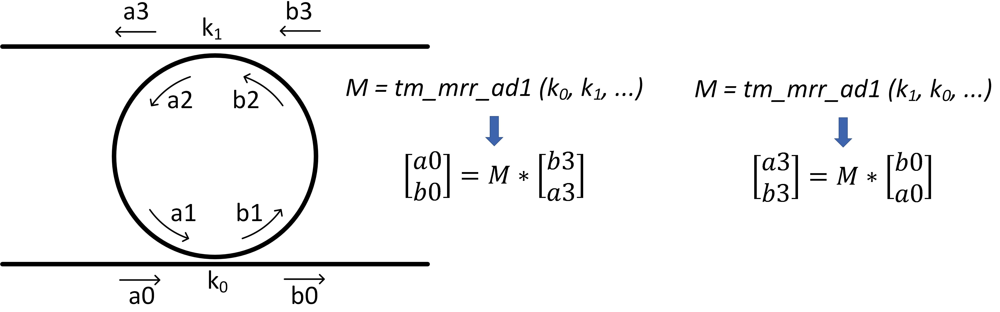
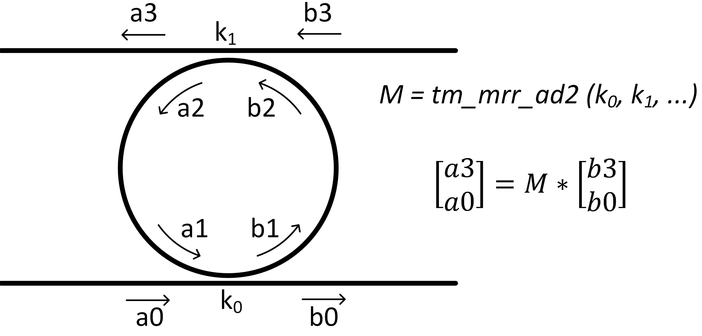

# Descriptions of  Functions
### Function list:
- fun_get_disp_cur 

- tm_dc1 

- tm_dc2

- t_mrr_ap

- tm_admrr1

- tm_admrr2

- admrr

- cas_mrr

  

NOTE: To be able to use these functions in your MATLAB, **the folder including the functions need to be included in the MATLAB searching paths.** Using `pathtool` command in MATLAB can easily achieve this.


#### [lams, neffs, betas] = fun_get_disp_cur (lam_info, wg_info)

This function returns  neff-vs-lambdas and the corresponding betas-vs-lambdas (i.e., dispersion curve) from the lambda info and waveguide info.

Example usage:

```matlab
...
% simulation lambda range
sim_lam_info = struct('lam_center', 1.5592e-6, 'lam_span', 25e-9, ...
    'nw', 3000);

% waveguide effective refractive index and group index of the waveguide at wavelength = 1.55 um
wg_info = struct('lam_center', 1.55e-6, 'neff0', 2.43, 'ng', 4.2);

% acquire neff-vs-lambdas and the corresponding betas-vs-lambdas (i.e., dispersion curve) 
[lams, neffs, betas] = get_disp_cur (sim_lam_info, wg_info);

% calculate the transfer matrix (Type 1) of an add-drop microring resonator (admrr)
M = tm_admrr1 (k0, k1, radius, lams, betas, alpha);
...
```


#### tm_dc = tm_dc1 (kappa, t_c)

This function returns TYPE 1 matrix of a 2*2 directional coupler (DC),  shown below.
t_c: total transmission coefficient of the DC; for lossless DC, t_c = 1;


#### tm_dc = tm_dc2 (kappa, t_c)

This function returns TYPE 2 matrix of a 2*2 directional coupler (DC)


#### thrs = t_mrr_ap (kappa,radius,betas,alpha, ps)

This function returns the transmission coefficient, *t*, of an  all-pass microring resonator (mrr),


ps: phase shift (rad) inside the ring, which emulates a phase shifter (such as a heater) put inside the ring to shift the resonance peak;

#### M = tm_admrr1 (k0, k1, radius, betas, alpha)

This function returns Type 1 **transfer matrix** of an add-drop microring resonator (admrr),

The returned matrix has a size of $ 2 \times 2 \times \text{nw} $, where nw is the number of lambda points.

- k0, k1: kappas of the lower and upper directional couplers of the admrr; 
- alpha: loss per length (1/m)

**Note**: the order of k0, k1 is IMPORTANT:  tm_admrr1 (k0, k1, ...) and  tm_admrr1 (k1, k0, ...) means different things (see below); 





#### M = tm_admrr2 (k0,k1,radius, betas,alpha)

This function returns Type 2 **transfer matrix** of an add-drop microring resonator (admrr)

**Note: the relationships between various types of transfer matrices for MRRs can be calculated in *M_Transform.m***




#### [thrs, drs] = admrr (k0, k1, radius, betas, alpha)

This funtion calculates the drop  and through port transmission coefficient of an admrr;
admrr: add-drop microring resonator, which has two bus waveguides.


#### [thrs, drs] = cas_mrr (g, k1, k2, radius, betas, alpha)

This function returns through- and drop-port transmission coefficients of cascaded micro-ring resonators, with typical structures shown below:


Variable explanations:

1. g: the number of the rings;
2. k1: kappa between the straight bus waveguide and ring
3. k2: kappa between adjacent rings
4. radius: radii of the rings

Here it is assumed that:

1. all the MRRs have the same radii.
2. the kappas (k1) between the straight bus waveguide and the ring are the same.
3. kappas (k2)  between all the adjacent MRRs are the same.


