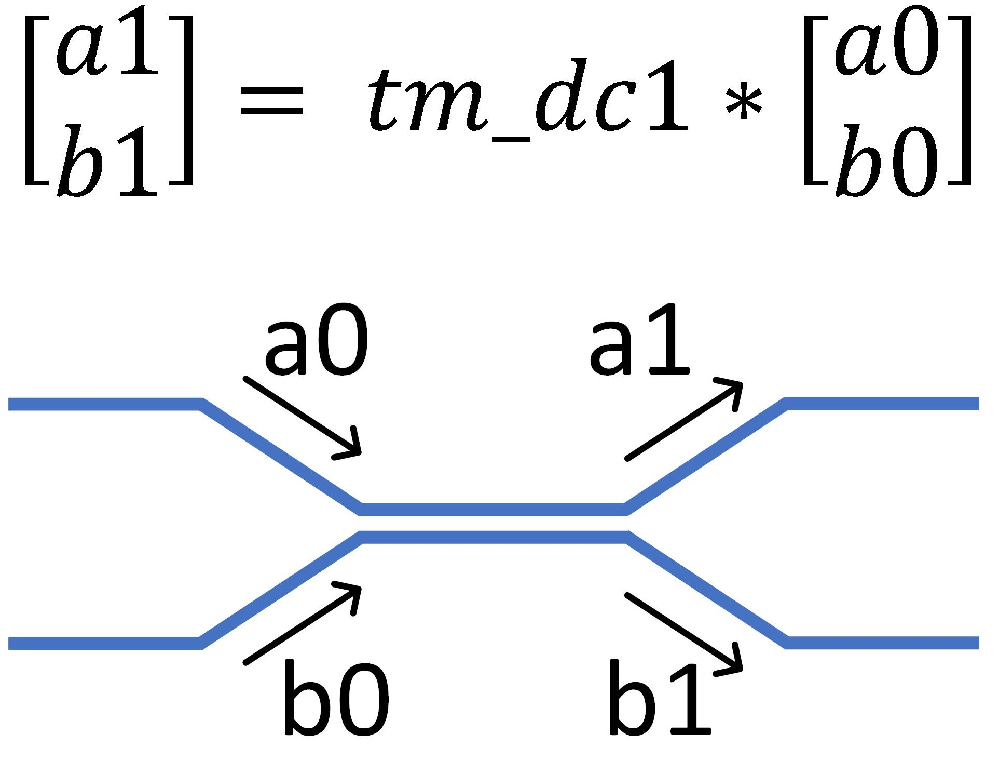
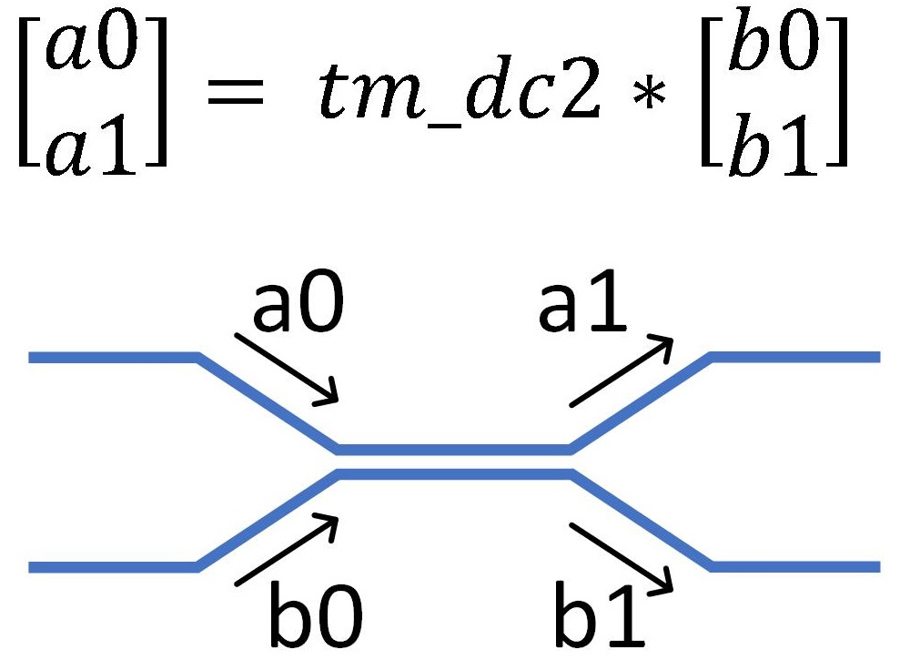
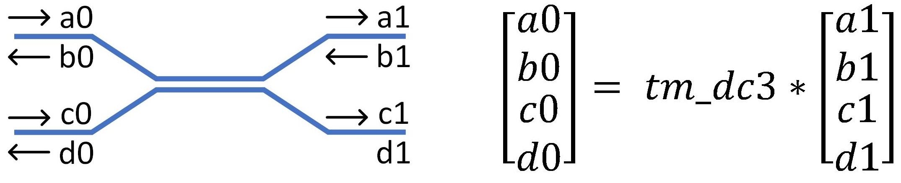
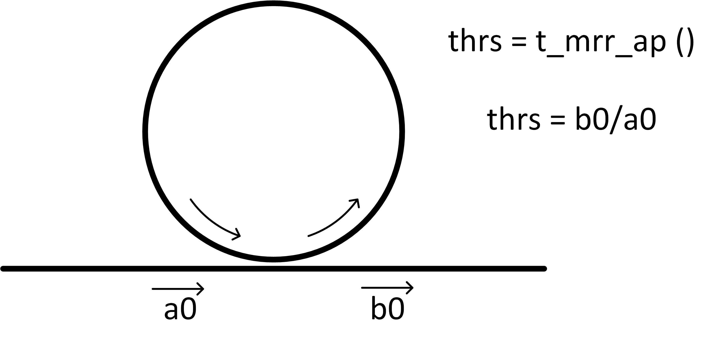
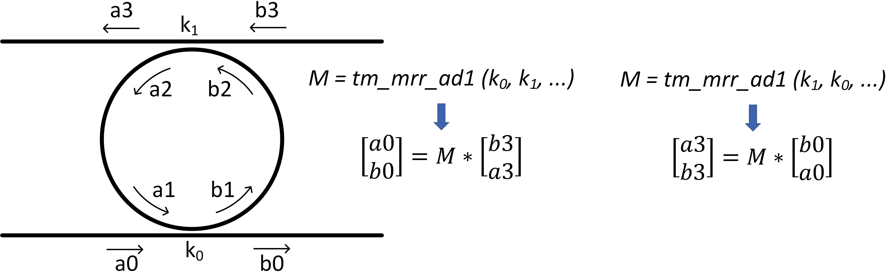
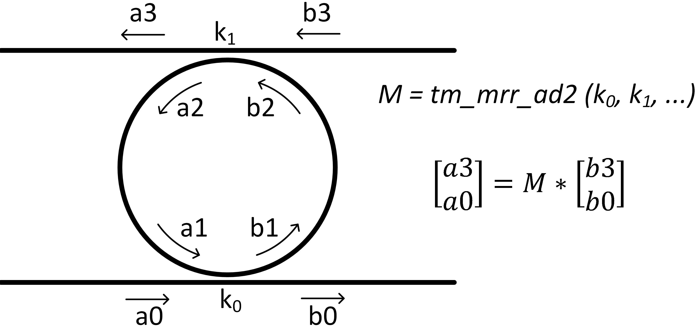
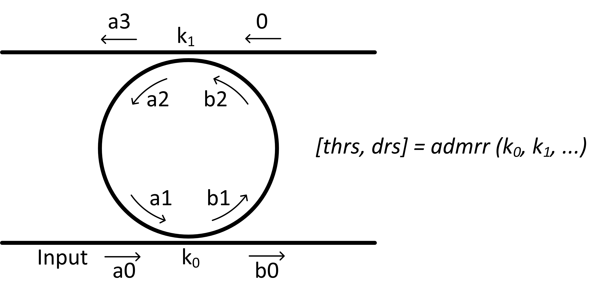

# Descriptions of  Functions
### Function list:
- fun_get_disp_cur 

- tm_dc1 

- tm_dc2

- tm_dc3

- t_mrr_ap

- tm_admrr1

- tm_admrr2

- admrr

- cas_mrr

- alpha_cal1

- alpha_cal2

- loss_per_cm_dB_cal

-  lam2det

- tmmcalc

- phase

- pha2gp

- kappa_cal1

- mrrfsr_cal

  

NOTE: To be able to use these functions in your MATLAB, **the folder including the functions need to be included in the MATLAB searching paths.** Using `pathtool` command in MATLAB can easily achieve this.


#### [lams, neffs, betas] = fun_get_disp_cur (lam_info, wg_info)

This function returns  neff-vs-lambdas and the corresponding betas-vs-lambdas (i.e., dispersion curve) from the *lambda info* and *waveguide info*.

- *lam_info*: a struct containing simulation wavelength information, and has various fields below:
  - *lam_center*: simulation wavelength center
  - *lam_span*:   simulation wavelength span
  - *nw*: total number of the simulation wavelength points
- *waveguide info*: a struct containing waveguide information, and has various fields below:
  - *neff*, *ng*, and *lam_center*: waveguide effective refractive index and group index at the wavelength = *lam_center*
  - alpha: waveguide power propagation loss (1/m)

**Example usage:**

```matlab
...
% simulation lambda range
sim_lam_info = struct('lam_center', 1.5592e-6, 'lam_span', 25e-9, ...
    'nw', 3000);

% waveguide effective refractive index and group index of the waveguide at wavelength = 1.55 um
wg_info = struct('lam_center', 1.55e-6, 'neff0', 2.43, 'ng', 4.2,  'alpha', alpha);

% acquire neff-vs-lambdas and the corresponding betas-vs-lambdas (i.e., dispersion curve) 
[lams, neffs, betas] = get_disp_cur (sim_lam_info, wg_info);

% calculate the transfer matrix (Type 1) of an add-drop microring resonator (admrr)
M = tm_admrr1 (k0, k1, radius, betas);
...
```


#### tm_dc = tm_dc1 (kappa, t_c)

This function returns TYPE 1 matrix of a 2*2 directional coupler (DC),  shown below.
t_c: total transmission coefficient of the DC; for lossless DC, t_c = 1;




#### tm_dc = tm_dc2 (kappa, t_c)

This function returns TYPE 2 matrix of a 2*2 directional coupler (DC)




#### tm_dc = tm_dc3  (kappa, t_c)

This function returns TYPE 3 matrix of a **4*4** directional coupler (DC), as shown below. An example usage of this function can be found in *"E:\SiP-Simulations\Grating_in_circuits\MZI_IBG1\MZI_IBG1_v1"*



#### thrs = t_mrr_ap (kappa,radius,betas,ps)

This function returns the transmission coefficient, *t*, of an  all-pass microring resonator (mrr),




ps: phase shift (rad) inside the ring, which emulates a phase shifter (such as a heater) put inside the ring to shift the resonance peak;

#### M = tm_admrr1 (k0, k1, radius, betas, ps)

This function returns Type 1 **transfer matrix** of an add-drop microring resonator (admrr),

The returned matrix has a size of $ 2 \times 2 \times \text{nw} $, where nw is the number of lambda points.

- k0, k1: kappas of the lower and upper directional couplers of the admrr; 
- alpha: loss per length (1/m)
- ps: phase shift (rad) inside the ring, which emulates a phase shifter put inside the ring and can shift the resonance peak;

**Note**: the order of k0, k1 is IMPORTANT:  tm_admrr1 (k0, k1, ...) and  tm_admrr1 (k1, k0, ...) means different things, as shown below:  




#### M = tm_admrr2 (k0,k1,radius, betas, ps)

This function returns Type 2 **transfer matrix** of an add-drop microring resonator (admrr)

**Note: the relationships between various types of transfer matrices for MRRs can be calculated in *M_Transform.m***




#### [thrs, drs] = admrr (k0, k1, radius, betas)

This funtion calculates the drop  and through port transmission coefficient of an admrr;
admrr: add-drop microring resonator, which has two bus waveguides.



#### [thrs, drs] = cas_mrr (g, k1, k2, radius, betas, alpha)

This function returns through- and drop-port transmission coefficients of cascaded micro-ring resonators, with typical structures shown below. An example usage of this function can be seen in *"SiP-Simulations\microring_resonators\CascadedMRRs\MRR_cascaded_cal.m"*.


Variable explanations:

1. g: the number of the rings;
2. k1: kappa between the straight bus waveguide and ring
3. k2: kappa between adjacent rings
4. radius: radii of the rings

Here it is assumed that:

1. all the MRRs have the same radii.
2. the kappas (k1) between the straight bus waveguide and the ring are the same.
3. kappas (k2)  between all the adjacent MRRs are the same.

#### alpha = alpha_cal1 (loss_per_cm_dB)

Calculate light amplitude propagation loss (1/m), alpha,  from the loss per cm in dB

#### alpha = alpha_cal2 (scale, length)

Calculate waveguide power propagation loss (1/m), *alpha*,  from the light transmission coefficient for  a waveguide  length of *length*. 

Example usage:

if the amplitude of the light becomes 0.5 smaller compared with the original amplitude after propagating a 1 cm waveguide, the corresponding alpha can be easily calculated by using this function:

`alpha = alpha_cal2 (0.5, 1e-2);`

#### loss_per_cm_dB = loss_per_cm_dB_cal(alpha)

Calculate loss_per_cm_dB from alpha

#### [detuning] = lam2det (ng, lam_center, lambdas)

Translate wavelengths into wavelength detunings

- lambdas: a 1*n scalar including all the discrete wavelengths
- ng: group index
- lam_center: wavelength center of the lambdas

#### [r,t] = tmmcalc (q, dz, detuning)

Calculate the reflection and transmission responses of a Bragg grating

- q: a scalar, which is a discrete version of the grating strength and phase distribution along the grating length
- dz:  the physical distance between adjacent points of q 
- detuning:  wavelength detuning, which can be easily translated from wavelengths using function *lam2det ()*

#### [y] = phase (x) 

Calculate the phase profile of x

#### [gp] = pha2gp (w, pha, lam_center)

Convert a phase response to a group delay (GP) response, based on the fact that GP response is the first derivative of the phase response

Input Parameters: 

- w: lambdas (m);
- pha: phase response (rad)
- lam_center: center_wavelength (m)

#### kappa = kappa_cal1 (R,L)

This function calculates kappa of a Bragg grating from its maximum reflectivity (0 - 1) and the length (unit: m);

The general concept is that we first calculate kappa from a very short Bragg grating (as its simulation time is short). Then, the calculated kappa is used in CMT-TMM for estimating spectrum features of a same Bragg grating except having a much longer length.  

Example usage: for calculating kappa of a Bragg grating with a length of 300e-6 m and a maximum reflectivity of 0.1, we can use:  
`kappa = kappa_cal1 (0.1, 300e-6);` which will give the kappa of about 1.09e3 m^(-1)

Input Parameters: 

- R: maximum reflectivity of the grating, from 0 to 1
- L: length of the grating; unit: m;

#### fsr = fsrcal (dl, ng, lam0)

This function calculates FSR of a microring resonator or a MZI , according to the euqation $FSR = \frac{\lambda^2}{Ln_g}$  

variables:

- dl (unit: m): 
  - for MZIs, it is the length difference between the two arms;
  - for MRRs, it is the perimeter of the ring, which equals $2\pi r$
- ng: group index of the waveguide
- lam0 (unit: m): center wavelength of the interested wavelength band


