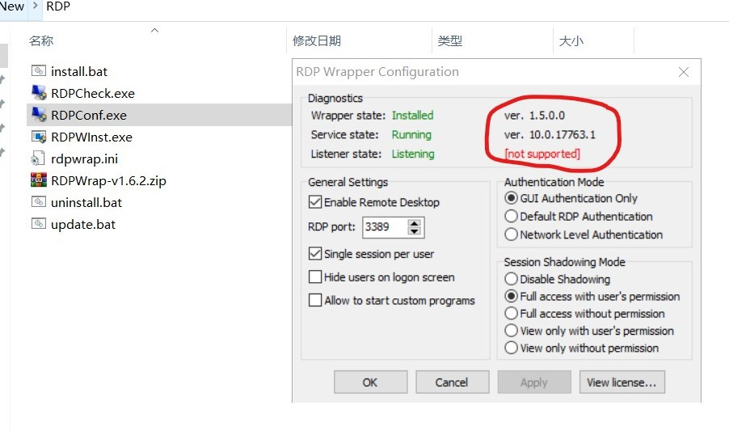
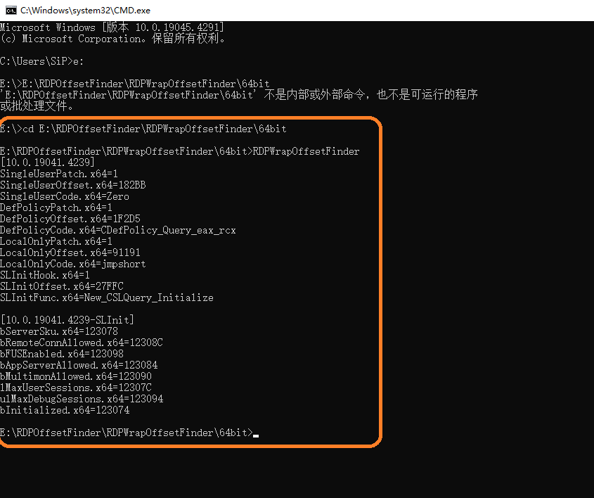
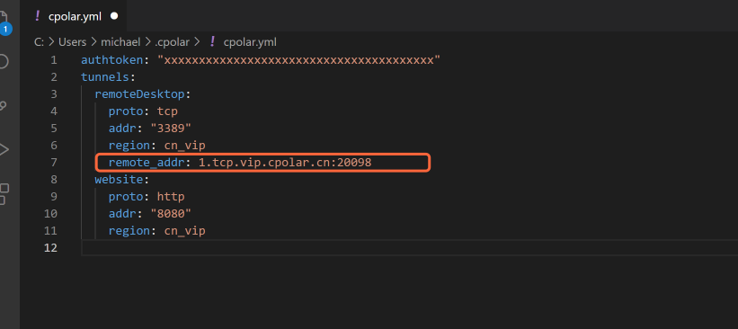

# Windows系统下多人同时远程登陆并操作工作站

当我们具有一台多核心、高性能的工作站时（如核心数大于30的工作站），常规的只允许单人操作工作站的方式将会引起计算资源的浪费。而若能实现多人同时、互不影响的操作计算机，可实现计算资源的最大化利用。

具体地，一些仿真软件计算速度往往在使用其70% 的核心数便达到瓶颈，且不会随着核数继续增加而增快（受限于内存带宽），如Lumerical， 见 [FDTD Performance Benchmarks](https://support.lumerical.com/hc/en-us/articles/4403780894355)。在此背景下，若多人可同时使用工作站，哪怕每人在其仿真中设置只使用1/3的核心数，也可使得总体的计算资源利用效率大大增加，也减去了其它用户的等待时间。

该笔记记录了下我在Windows系统下，实现多人远程登录、操作工作站的方法。

### 基本原理

- Windows 系统自带的远程桌面连接系统，即通过输入目标电脑的IP地址，便可远程登陆、操作该计算机。

- 一台计算机的Windows 系统下可建立多个账户。因此每个用户可通过远程桌面连接、输入各自的用户名和密码，从而登录自己的账户，并同时操作该计算机

### 操作系统

#### Windows Server 系统

我们常规使用的Windows桌面级操作系统，如Win 7，Win 10， Win 11，并不支持多人同时远程登陆自己的账户、互不影响地操作一台计算机。即，当B用自己的账户使用计算机时，若A尝试在该计算机上登陆自己的账户，则将会将B账户挤出登录。

但**Windows服务器级操作系统**，可实现多人同时远程登陆、操作一台计算机。我在 *Windows Server  2022  数据中心版 64位英文版* 的系统中，验证了其可行性。

#### Windows 7、Windows 10系统

如上所述，默认情况下，Win 7、Win 10 操作系统并不支持多人同时远程登陆。但是，可以使用GitHub上一款由stascorp 开发的、较有名的开源插件[rdpwrap](https://github.com/stascorp/rdpwrap)来实现多人远程登录功能。通过[rdpwrap Releases](https://github.com/stascorp/rdpwrap/releases)，可下载相关文件。 其基本原理是通过其提供的配置文件**rdpwrap.ini**，来使得系统支持多人同时远程登陆。

安装步骤：

Installation instructions:

> - Download latest release binaries and unpack files
> - Right-click on **`install.bat`** and select Run as Administrator
> - See command output for details

安装后，可打开文件夹中的RDPConf.exe文件，检查是否支持。

然而，由于stascorp提供的 rdpwrap 近几年都未更新，同时由于Windows系统的不断更新，安装rdpwrap后，打开RDPConf.exe文很大概率出现 [not supported] 的红色字样（如下图所示），原因是 rdpwrapi.ini 文件太旧，无法匹配最新的Windows 系统。此时需要用新的 rdpwrapi.ini文件，代替旧的 rdpwrapi.ini文件。

幸运的是，[sebaxakerhtc](https://github.com/sebaxakerhtc) 在github上创立了一个用于自动更新rdpwrapi.ini的repository，[rdpwrap.ini](https://github.com/sebaxakerhtc/rdpwrap.ini)。因此，最新的rdpwrapi.ini可以随时在该repository上下载。随后，将该配置文件，覆盖于之前的旧的rdpwrapi.ini，即可解决问题。**该文件一般位于 C:\Program Files\RDP Wrapper 中**。

更新完后（及覆盖新的rdpwrapi.ini后），为了使其生效，需要点击 服务- Remote Desktop Service, 并重启该项；或者重启电脑。

更新于2024-04-11：上述仓库已不再更新。可通过https://github.com/llccd/RDPWrapOffsetFinder/releases提供的APP，在CMD中运行RDPWrapOffsetFinder.exe，将运行后CMD中出现的字符手动复制（添加）到rdpwrapi.ini中。整体CMD操作命令（包括目录转换）如下图所示。

注意：cmd中使用cd切换路径时，只能同磁盘切换不同目录，不能跨磁盘切换，因此需先切换到目标磁盘，切换磁盘的命令为盘符加冒号，如”D:“。

### 远程桌面连接

由于大部分情况下，**用户所操作的计算机（PC）与工作站PC并不在同一个局域网下**，因此这里将介绍在**外网**远程登陆目标PC的方法。

#### 远程桌面连接方式：

Windows 系统左下方搜索*远程桌面*，将会弹出*远程桌面连接*，点击后将会出现连接窗口，如下图：

其中输入目标PC的IP地址，之后输入该PC上的用账户名和密码，便可实现远程连接、登录该台PC。接下来，将着重记录远程PC的IP地址的确定方法。

#### 远程PC的IP地址

以我们实验室为例，实验室有三台工作站，均通过有线与一台路由器相连。因此，这三台路由器具有相同的公网IP，这是因为它们在同一个局域网内。而我们操作端的PC，大部分情况在该局域网之外，即，在外网。

首先查看工作站的公网IP，最简单的方法是在工作站上，直接百度`IP`,之后页面将显示它们共同的公网IP地址，如下图所示：

然而，我们并不能在远程连接中，直接输入工作站的公网IP，连接至我们的工作站。因为同一个路由器下的工作站或电脑具有相同的公网IP。因此，输入公网IP后，网络并不知道我们想要连接哪一台电脑。

接下来查看私网IP，私网IP是同一个局域网中分配给不同设备的IP，用来区分局域网内部的设备。查看方法，在工作站上，`Win + R`,打开运行窗口，之后输入`CMD`进入命令模式，之后输入`ifconfig`，即可查看该设备的内网IP （注意是IP4），如下图：

那么如何在该局域网之外，远程连接并登录某局域网内指定的工作站呢？解决方法是利用端口映射的方法。其大致意思是用端口号的方法，区分局域网内部的PC，之后便可通过在远程登陆界面输入`公网IP:外部端口`，找到并登录某个工作站。

#### 端口映射

下面以我们目前使用的TP-LINK路由器为例，记录端口映射的设置方法。

1. 首先登陆连接局域网的路由器的管理页面，并进入到*应用管理 — 虚拟服务器*，之后进入下图界面。

2. 添加设备（及该局域网下的工作站），不同设备可通过其内网IP地址区分（如何查看设备的内网IP前文已经介绍）。

3. 给不同设备定义不同的属于自己的**外部端口**，该端口可输入随意的值，主要用以区分作用。

4. 将所有设备的内部端口，设置为 **3389**，这是Windows远程桌面的默认端口。
5. 在 *应用管理 - IP 与 MAC绑定* 中， 将设备的内网IP绑定起来，使得它们具有固定的内部IP地址。（因为我们不希望每次重新连接一次路由器，设备的内部IP会发生变动，这样会导致我们在虚拟服务器设置端口对应的设备将发生变化，从而导致连接失败。）设置完毕后，保存即可立即生效。

这样设置，便可通过在远程连接时，输入`公网IP:外部端口号`，(如 `192.168.111.1:2`) 找到并登录某个工作站。其整体的工作流程我的大致理解是：

1. 输入`公网IP:外部端口号`后，我们的PC会先找到公网IP的局域网，之后PC发现局域网下有多台设备连接。
2. 我们的PC进一步通过外部端口号，找到我们想要连接的设备（即工作站）。
3. 网络找到该设备后，由于该设备的内部监听端口3389为Windows远程桌面的默认端口，于是它明白是需要实现远程桌面连接，因此便开启远程桌面。

#### 防火墙设置

上述设置好了后，注意需要将windows 防火墙中可允许的应用，添加远程桌面，否则可能会出现远程登陆无响应的情况。

### 目前遇到的问题和解决方法

#### 校外无法远程登陆校园网内工作站

目前只有在校园网内，可使用上述方法远程登录工作站，校园网外却无法登录。原因可能是，处于安全性的考虑，校园网将3389端口屏蔽了。目前我们所使用的解决方法是使用商业软件是实现内网穿透，如[cpolar远程桌面](https://www.zhihu.com/question/30400516/answer/2303437186)、花生壳等。

##### 具体解决方案 

利用[cpolar](https://www.cpolar.com/)内网穿透软件，实现了在校外通过远程桌面访问工作站。引用 https://zhuanlan.zhihu.com/p/519194712 中的说明，主要安装步骤为：

1. 官网注册，并在被控端（即工作站）安装cpolar内网穿透软件
2. 配置token认证令牌：先登录官网查看TOKEN号，之后在被控端，在CMD中输入下面命令

​	`cpolar authtoken <YOUR_AUTHTOKEN>`

3. 在被控端，浏览器访问http://localhost:9200/，登录cpolar web UI管理界面
4. 在隧道列表找到远程桌面隧道，并启动
5. 在官网中，状态——在线隧道列表，找到远程桌面隧道所映射的公网地址，可以看到是由本地3389端口映射的，复制该公网地址
6. 控制端电脑打开远程桌面连接，使用所获取的公网地址，以及被控端电脑的账号密码，就可以实现公网远程桌面连接

另外，尽管cpolar有免费版本，但是免费版本的公网地址会随机变化，给远程桌面连接带来诸多不便。且免费版带宽较小（速度慢）。因此，我们升级成了专业版本，主要为了利用其2个特点

1. 固定TCP端口地址，即固定的远程桌面连接地址。
2. 带宽更大。

下面介绍固定TCP地址的方法。

###### 固定TCP端口地址的方法

参考[远程办公必备：如何通过cpolar远程控制桌面，配置固定TCP端口地址](https://zhuanlan.zhihu.com/p/456435431)，主要步骤为：

> 1. 升级成专业版
>
> 2. 登录cpolar官网后台，进入`预留`
>
> 3. 在`保留的TCP地址`下，地区选择`China VIP`地区，填写`备注`信息，点击`保留`按钮。系统会在后台为您提供一个全网唯一的TCP固定端口地址。
>
> 4. 配置cpolar配置文件，添加预留的地址：我们使用vs code，打开cpolar配置文件。 默认路径: C:\Users\<我的用户名>\.cpolar\cpolar.yml
>
>    我们在隧道remoteDesktop下面，增加了一个remote_addr参数，参数值填写为我们之前向系统申请的保留TCP地址。如下图红框所示。
>
>    注意：remote_addr参数要与上面的(region, addr等)参数缩进一致。
>
>    配置完，我们保存文件。
>
>    
>
> 5. 重启cpolar后台服务：在Windows搜索栏输入`服务`并打开。在服务列表中，找到`cpolar Service'服务，按右键弹出菜单，选择`重新启动`，如下图
> 6. 查看在本隧道列表

注意：以上需要先为客户端和主机绑定，使用：`./cpolar authtoken`

#### 路由器重启后，远程登陆忽然失效

使用过程中，我们常发现远程登陆会忽然失效。该情况有可能发生在机房意外断电、跳闸使得路由器重启之后。该问题，有可能仅仅是由于我们实验室路由器的bug导致的。

##### 解决方法：

我们发现可能有效的解决方法是，

- 进入在路由器的管理页面
- 先找到该工作站的局域网内IP（如192.168.1.108），方法：
  - 路由器管理界面可找到，或
  - CMD中输入输入`ifconfig`，即可查看该设备的内网IP （注意是IP4）
- 进入到*应用管理 — 虚拟服务器*，通过IP，找到对应该工作站的虚拟服务器。
- 仅将该工作站对应的虚拟服务器，删除。之后重新创建、输入与之前相同的外部和内部端口号，之后保存。
- 测试远程登陆是否恢复正常。

#### 单用户出现多个远程登陆会话

有时，我们发现单用户每次远程登陆工作站，都会创建一个新的远程登陆会话（任务管理器-用户 中会出现多个具有相同用户名的会话）。

##### 解决方法：

只需简单的更改下系统的配置即可，可参考 [Windows server 2012将远程用户限制到单独的远程桌面会话解决](https://blog.csdn.net/xuchen16/article/details/82787247)，

具体的，是在计算机本地组策略中，启用 “将远程桌面服务用户限制到单独的远程桌面”。

#### 通过Cpolar的远程登陆方式偶尔失效

我们偶尔发现通过Cpolar提供的端口地址登陆远程工作站，偶尔失效（远程无响应）。此时若进入到cpolar官网-个人账户-状态，可看到此工作站对应的隧道名称在隧道列表中消失，说明此时远程登陆失效，可能是由于隧道掉线的原因。

##### 解决方法：

windows 左下角，搜索“服务”，之后在右侧栏的服务列表中，找到 “cpolar service”，之后重启它。

最后，有问题，可通过rcheng@hfut.edu.cn 与我联络。

