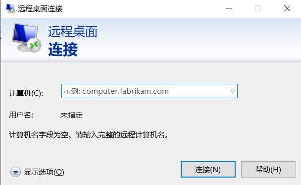
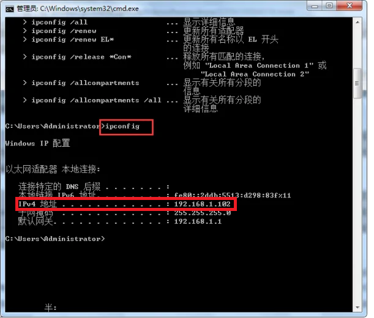
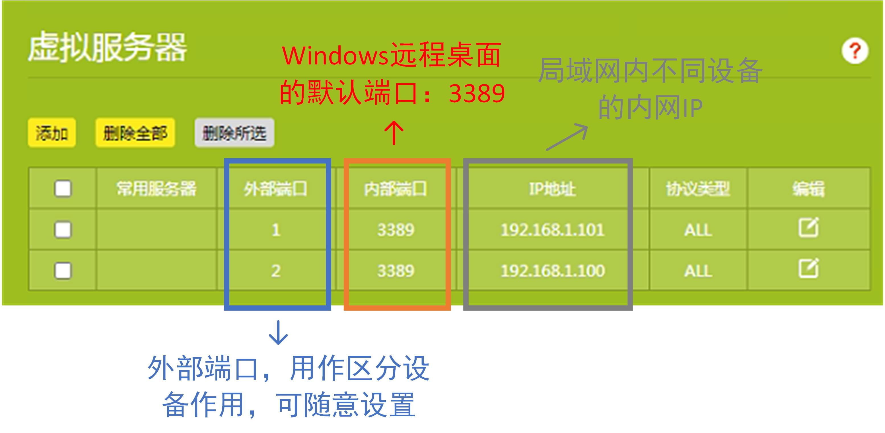

# Windows系统下多人同时远程登陆并操作工作站

当我们具有一台多核心、高性能的工作站时（如核心数大于20的工作站），常规的只允许单人操作工作站的方式将会引起计算资源的浪费。而若能实现多人同时、互不影响的操作计算机，可实现计算资源的最大化利用。

具体地，一些仿真软件计算速度往往在使用其70% 的核心数便达到瓶颈，且不会随着核数继续增加而增快（受限于内存带宽），如Lumerical， 见 [FDTD Performance Benchmarks](https://support.lumerical.com/hc/en-us/articles/4403780894355)。在此背景下，若多人可同时使用工作站，哪怕每人在其仿真中设置只使用1/3的核心数，也可使得总体的计算资源利用效率大大增加，也减去了其它用户的等待时间。

该笔记记录了下我在Windows系统下，实现多人远程登录、操作工作站的方法。

#### 基本原理

- Windows 系统自带的远程桌面连接系统，即通过输入目标电脑的IP地址，便可远程登陆、操作该计算机。

- 一台计算机的Windows 系统下可建立多个账户。因此每个用户可通过远程桌面连接、输入用户名和密码，从而登录自己的账户，并操作同台计算机

#### 操作系统

我们常规使用的Windows桌面级操作系统，如Win 7，Win 10， Win 11，并不支持多人同时远程登陆自己的账户、互不影响地操作一台计算机。即，当B用自己的账户使用计算机时，若A尝试在该计算机上登陆自己的账户，则将会将B账户挤出登录。

但**Windows服务器级操作系统**，可实现多人同时远程登陆、操作一台计算机。我在 *Windows Server  2022  数据中心版 64位英文版* 的系统中，验证了其可行性。

#### 远程桌面连接

由于大部分情况下，**用户所操作的计算机（PC）与工作站PC并不在同一个局域网下**，因此这里将介绍在**外网**远程登陆目标PC的方法。

##### 远程桌面连接方式：

Windows 系统左下方搜索*远程桌面*，将会弹出*远程桌面连接*，点击后将会出现连接窗口，如下图：

其中输入目标PC的IP地址，之后输入该PC上的用账户名和密码，便可实现远程连接、登录该台PC。接下来，将着重记录远程PC的IP地址的确定方法。

##### 远程PC的IP地址

以我们实验室为例，实验室有三台工作站，均通过有线与一台路由器相连。因此，这三台路由器具有相同的公网IP，这是因为它们在同一个局域网内。而我们操作端的PC，大部分情况在该局域网之外，即，在外网。

首先查看工作站的公网IP，最简单的方法是在工作站上，直接百度`IP`,之后页面将显示它们共同的公网IP地址，如下图所示：

然而，我们并不能在远程连接中，直接输入工作站的公网IP，连接至我们的工作站。因为同一个路由器下的工作站或电脑具有相同的公网IP。因此，输入公网IP后，网络并不知道我们想要连接哪一台电脑。

接下来查看私网IP，私网IP是同一个局域网中分配给不同设备的IP，用来区分局域网内部的设备。查看方法，在工作站上，`Win + R`,打开运行窗口，之后输入`CMD`进入命令模式，之后输入`ifconfig`，即可查看该设备的内网IP （注意是IP4），如下图：

那么如何在该局域网之外，远程连接并登录某局域网内指定的工作站呢？解决方法是利用端口映射的方法。其大致意思是用端口号的方法，区分局域网内部的PC，之后便可通过在远程登陆界面输入`公网IP:外部端口`，找到并登录某个工作站。

##### 端口映射方法

下面以我们目前使用的TP-LINK路由器为例，记录端口映射的设置方法。

1. 首先登陆连接局域网的路由器的管理页面，并进入到*应用管理 — 虚拟服务器*，之后进入下图界面。

2. 添加设备（及该局域网下的工作站），不同设备可通过其内网IP地址区分（如何查看设备的内网IP前文已经介绍）。

3. 给不同设备定义不同的属于自己的**外部端口**，该端口可输入随意的值，主要用以区分作用。

4. 将所有设备的内部端口，设置为 **3389**，这是Windows远程桌面的默认端口。
5. 在 *应用管理 - IP 与 MAC绑定* 中， 将设备的内网IP绑定起来，使得它们具有固定的内部IP地址。（因为我们不希望每次重新连接一次路由器，设备的内部IP会发生变动，这样会导致我们在虚拟服务器设置端口对应的设备将发生变化，从而导致连接失败。）设置完毕后，保存即可立即生效。

这样设置，便可通过在远程连接时，输入`公网IP:外部端口号`，(如 `192.168.111.1:2`) 找到并登录某个工作站。其整体的工作流程我的大致理解是：

1. 输入`公网IP:外部端口号`后，我们的PC会先找到公网IP的局域网，之后PC发现局域网下有多台设备连接。
2. 我们的PC进一步通过外部端口号，找到我们想要连接的设备（即工作站）。
3. 网络找到该设备后，由于该设备的内部监听端口3389为Windows远程桌面的默认端口，于是它明白是需要实现远程桌面连接，因此便开启远程桌面。

#### 目前的问题

上列方法在实际使用中，仍存在一些问题有待解决

- 目前只有在校园网内，可使用上述方法远程登录工作站。校园网外却无法登录，原因未知。可能的解决方法是需要使用商业软件是实现内网穿透，如[cpolar远程桌面](https://www.zhihu.com/question/30400516/answer/2303437186)、花生壳等。
- 可能会出现的问题：对于一些高校（如HFUT）的校园网，连接校园网的设备超过一定时间可能会自动断线，且需要重新验证、登录、连接。尚不知是否该重新连接是否会再次分配该局域网一个新的公网IP？若是，则意味着远程登陆时所输入的公网IP可能是需要随时发生变化。尚不知解决方法。

